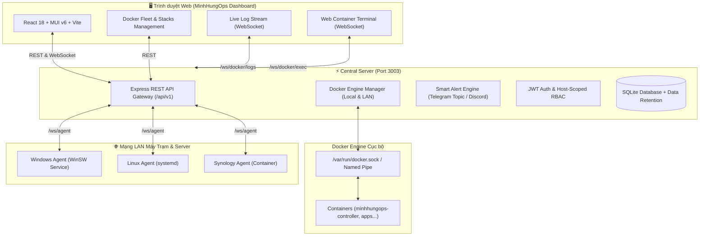

# MinhHungOps — Unified Fleet, Docker & LAN Operations Controller

[](https://nodejs.org/)
[](https://www.docker.com/)
[](https://playwright.dev/)
[](https://nodejs.org/api/test.html)
[](https://github.com/nmhung1993)
[-blueviolet.svg)]()

**MinhHungOps** là nền tảng quản trị và giám sát tập trung toàn diện cho hạ tầng máy chủ, máy trạm Windows, Linux, Synology NAS và cụm container Docker trong mạng LAN tin cậy. Hệ thống tích hợp khả năng quản lý Docker chuẩn Dockhand, giám sát phần cứng S.M.A.R.T, tự phục hồi Watchdog với cảnh báo Telegram Topic/Discord riêng biệt từng máy, kiểm tra mạng/Router Mesh, và thực thi lệnh từ xa an toàn.

---

## 🌟 Tính Năng Nổi Bật

### 🐳 1. Quản lý Docker Fleet Chuẩn Dockhand (Local & LAN Hosts)
- **Quản lý Vòng đời Container (Lifecycle Control)**: Thao tác 1-Click: *Start, Stop, Restart, Pause, Unpause, Kill, Remove, Prune*.
- **Gom nhóm theo Compose Stack (Group by Stack)**: Tự động gom nhóm các container theo project, hỗ trợ đóng/mở (Collapse/Expand) từng stack hoặc toàn bộ.
- **Giám sát CPU & RAM thời gian thực**:
  - Từng container: Hiển thị thanh đo % CPU và RAM thực tế (MB/GB).
  - Toàn bộ Stack: Huy hiệu tổng hợp CPU % và RAM tiêu thụ của cả stack (ví dụ: `⚡ 0.2% CPU` | `💾 695 MB RAM`).
- **Bộ lọc & Sắp xếp Đa tiêu chí**: Sắp xếp theo Tên (A-Z / Z-A), CPU cao nhất, RAM cao nhất, Trạng thái chạy.
- **Live Logs Streaming**: Stream log trực tiếp từ Docker daemon qua WebSocket với màu sắc ANSI, hỗ trợ tải file log `.log`.
- **Interactive Web Terminal (Exec Console)**: Mở shell hai chiều (`/bin/sh` hoặc `/bin/bash`) trực tiếp bên trong container ngay trên trình duyệt web.
- **Inspect Chi tiết Container**: Xem toàn bộ biến môi trường (Env vars), Mounts/Volumes, Cổng mạng, IP Address, và chính sách Restart Policy.
- **Images & Volumes**: Thống kê dung lượng, hỗ trợ tính năng **Prune (Dọn rác)** 1-click an toàn.

### 🖥️ 2. Giám sát & Quản trị Máy Trạm Đa Nền Tảng (Multi-Platform Fleet)
- **Windows Agent**: Chạy dưới dạng Windows Service (`WinSW`), đọc phần cứng thấp tầng qua `LibreHardwareMonitorLib`, chip Nuvoton LPC/Xeon, và `nvidia-smi`.
- **Linux Agent**: Chạy qua `systemd`, thu thập telemetry chuẩn từ `/proc`, `sysfs`, `df`.
- **Synology NAS Agent**: Chạy độc lập hoặc trong container để giám sát Synology DSM.
- **Home Assistant Connector**: Đồng bộ telemetry từ các entity của Home Assistant.
- **Ẩn Hostname Thô (Hostname Masking)**: Tự động ẩn các tên máy thô dạng `DESKTOP-XXXXXX`, ưu tiên hiển thị Tên gợi nhớ (Display Name) tùy chỉnh.
- **Phân quyền Truy cập Máy (Host-Scoped RBAC)**: Phân quyền chặt chẽ giữa *Super Admin*, *Admin* (chỉ quản lý các máy được gán) và *Viewer* (chỉ xem).

### 📈 3. Giám sát Phần Cứng S.M.A.R.T & Telemetry
- **Đồ thị thời gian thực đa dải**: Hỗ trợ xem biểu đồ 60 phút, 8 giờ, 1 ngày, 1 tuần, 1 tháng, 6 tháng, 1 năm.
- **Nhiệt độ & Công suất (Power / Thermal)**: Ưu tiên CPU Package, nhiệt độ từng core, công suất tổng hệ thống thật.
- **S.M.A.R.T Disk Health**: Đọc tình trạng sức khỏe ổ đĩa NVMe / SSD / HDD, phân vùng và dung lượng lưu trữ.

### 🛡️ 4. Watchdog Tự Phục Hồi & Cảnh Báo Đa Kênh Riêng Biệt
- **Tự động khởi chạy lại ứng dụng/tiến trình** khi bị crash hoặc tắt đột ngột.
- **Cấu hình Cảnh báo Riêng Biệt Từng Máy (Per-Host Dedicated Alerts)**:
  - Hỗ trợ **Telegram Topic ID (`topicId`)**: Bắn cảnh báo sự cố vào đúng Topic của từng máy trong nhóm Supergroup Telegram.
  - Hỗ trợ **Discord Webhook URL riêng**: Tách biệt kênh thông báo cho từng cụm máy trạm.
- **Chụp ảnh màn hình tự động**: Chụp ảnh cửa sổ ứng dụng khi khởi chạy qua Watchdog hoặc khởi chạy thủ công.

### 🌐 5. Giám sát Mạng & Router Mesh
- **Ping Latency Monitor**: Theo dõi độ trễ kết nối mạng theo các mốc 1 giờ, 8 giờ, 1 ngày, 1 tuần.
- **LAN Subnet Scanner**: Quét và phát hiện toàn bộ thiết bị trong dải mạng nội bộ.
- **Xiaomi Router & Mesh Topology**: Hiển thị cấu trúc các node Router chính và Router phụ (Mesh).

### 💻 6. Remote PowerShell Console & OTA Upgrade
- **PowerShell Console**: Chạy lệnh và script PowerShell từ xa an toàn với preset câu lệnh tiện lợi.
- **Trung tâm Nâng cấp OTA (Over-The-Air)**: Nâng cấp phiên bản Agent hàng loạt chỉ với 1 click kèm Release Notes.

---

## 🏗️ Kiến Trúc Hệ Thống



---

## 🚀 Hướng Dẫn Triển Khai & Cài Đặt

### 1. Triển Khai Nhanh Bằng Docker Compose (Khuyến Nghị)

Central Server được đóng gói sẵn trong Docker container `minhhungops-controller`, tự động mount socket Docker của máy chủ để quản lý container:

```yaml
services:
  minhhungops-controller:
    build:
      context: .
      dockerfile: Dockerfile
    container_name: minhhungops-controller
    restart: unless-stopped
    ports:
      - "3003:3003"
    environment:
      - HOST=0.0.0.0
      - PORT=3003
      - DATA_DIR=/app/data
      - TZ=Asia/Bangkok
    volumes:
      - ./data:/app/data
      - /var/run/docker.sock:/var/run/docker.sock
```

Khởi chạy container:
```bash
docker compose up -d --build
```
Truy cập giao diện tại: **`http://localhost:3003`** (hoặc `http://<IP_LAN>:3003`).

---

### 2. Cài Đặt Central Server Trực Tiếp Trên Windows

Mở PowerShell bằng quyền **Run as Administrator**:
```powershell
Set-ExecutionPolicy -Scope Process Bypass
.\deploy\install-server.ps1 -Port 3003
```
Installer sẽ:
- Tạo service `Windows Controller Central Server` chạy nền.
- Mở cổng tường lửa Windows TCP 3003 cho dải mạng nội bộ (`LocalSubnet`).
- Khởi tạo cơ sở dữ liệu SQLite và thư mục dữ liệu an toàn.

---

### 3. Cài Đặt Agent Trên Máy Trạm

#### A. Máy Trạm Windows:
Chạy lệnh trong PowerShell (Administrator):
```powershell
Set-ExecutionPolicy -Scope Process Bypass
.\agent\install-agent.ps1 -ServerUrl "http://192.168.1.10:3003"
```
*(Tự động cài đặt WinSW Agent Service, Desktop Helper, LibreHardwareMonitor bridge và driver PawnIO).*

#### B. Máy Trạm Linux (Ubuntu / Debian / CentOS / Alpine):
```bash
sudo ./linux-agent/install-linux.sh --server-url http://192.168.1.10:3003
```

#### C. Synology NAS:
Triển khai file `synology-server/compose.yaml` hoặc chạy container Synology Agent kết nối về Central Server qua port 3003.

Sau khi cài Agent, vào mục **Quản trị ➔ Danh sách máy chờ duyệt** trên Dashboard để phê duyệt (Approve) máy trạm vào hệ thống.

---

## 🧪 Kiểm Thử & Đảm Bảo Chất Lượng (QA)

MinhHungOps được xây dựng với quy chuẩn kiểm thử tự động nghiêm ngặt:

### 1. Unit & Integration Tests (28 Test Suites)
```bash
npm test
```
```text
✔ Home Assistant connector escapes a WebSocket attempt stuck in CONNECTING
✔ Windows Agent reconnects after retry attempt
✔ desktop helper is launched through hidden VBS host
✔ Linux Agent ships systemd installer & telemetry protocol
✔ Synology Central Server deployment persists data
✔ DockerManager: socket config, demuxing, container actions & stats
✔ English and Vietnamese dictionaries cover UI translation keys
✔ Theme assets expose persistent light and dark variants
✔ Super admin UI role guards & host access assignments
ℹ tests 28 | suites 0 | pass 28 | fail 0 (100% Passed)
```

### 2. Playwright End-to-End Tests (13 Suites - 41 Tests)
```bash
node --test tests/e2e/*.test.js
```
```text
▶ 01. Auth & Roles: Login flow, token persistence, and role guards (3/3 Passed)
▶ 02. Dashboard & Telemetry: Live metrics & multi-range filters (2/2 Passed)
▶ 03. Fleet Management: Agent list, search, OTA Center & hostname masking (4/4 Passed)
▶ 04. Processes: Process listing, search filter, and pagination (1/1 Passed)
▶ 05. Watchdog & Automation: Heartbeat rules & dedicated per-host alerts (2/2 Passed)
▶ 06. Activity Logs: Audit log filtering and search (1/1 Passed)
▶ 07. Network Monitor: Ping Monitor ranges, Subnet Scanner & Mesh (2/2 Passed)
▶ 08. Admin & System Settings: Branding & Timezone GMT+7 (2/2 Passed)
▶ 09. Theme & i18n: Dark/Light mode and Vietnamese/English language (2/2 Passed)
▶ 10. Smart Alerts: Multi-Channel Notifications & Thresholds (1/1 Passed)
▶ 11. Remote PowerShell Console & Presets (2/2 Passed)
▶ 12. S.M.A.R.T Disk Health & Storage Breakdown (1/1 Passed)
▶ 13. Docker Fleet Management: Stack grouping, CPU/RAM, Sorting, Inspector (6/6 Passed)
ℹ tests 41 | suites 0 | pass 41 | fail 0 (100% Passed)
```

---

## 📂 Cấu Trúc Thư Mục Dự Án

```text
MinhHungOps/
├── server/                   # Backend Node.js Central Server
│   ├── server.js             # Express API gateway, WebSocket hub, Auth & Routing
│   ├── docker-manager.js     # Docker Engine Socket Client, Stats cache & Exec bridge
│   ├── database.js           # SQLite schema, migrations & data retention
│   ├── alert-engine.js       # Telegram (Topics), Discord Webhooks & Thresholds
│   ├── network-monitor.js    # Ping monitor, Subnet scanner & Xiaomi mesh
│   └── hardware-detector.js  # Sensor & hardware telemetry aggregation
├── frontend/                 # React 18 Single Page Application
│   ├── src/
│   │   ├── pages/            # DockerView, FleetView, DashboardView, NetworkView...
│   │   ├── layouts/          # DashboardLayout, NavSidebar, Header
│   │   ├── context/          # Auth, Language, Theme, WebSocket Contexts
│   │   └── locales/          # vi.json, en.json (Đa ngôn ngữ)
│   └── dist/                 # Production bundle biên dịch bởi Vite
├── agent/                    # Windows Agent runtime & installers
├── linux-agent/              # Linux Agent runtime & systemd installer
├── synology-server/          # Synology DSM Container Manager compose & scripts
├── homeassistant-addon/      # Home Assistant connector addon
├── tests/
│   ├── e2e/                  # 13 Playwright E2E Test Suites
│   └── helpers/              # E2E test browser context & auth helpers
├── test/                     # 28 Backend & Unit Test Suites
├── docker-compose.yml        # Docker Compose configuration (minhhungops-controller)
└── Dockerfile                # Multi-stage production container build
```

---

## 🛡️ Bảo Mật & Lưu Ý Vận Hành

- Bản triển khai mặc định hoạt động trong mạng nội bộ LAN tin cậy.
- Không port-forward trực tiếp cổng 3003 ra ngoài Internet nếu không có lớp bảo vệ SSL/HTTPS (Reverse Proxy như Caddy, Nginx hoặc Cloudflare Tunnel).
- Phân quyền nghiêm ngặt: Tạo tài khoản *Admin* hoặc *Viewer* được giới hạn chỉ truy cập đúng các máy trạm cần thiết.
- Khóa bí mật (JWT secret) được tạo ngẫu nhiên an toàn theo từng lần cài đặt tại thư mục dữ liệu `data/`.

---

## 👨‍💻 Tác Giả & Bản Quyền

- **Phát triển bởi**: `@nmhung1993`
- **Múi giờ vận hành**: GMT+7 (`Asia/Ho_Chi_Minh`)
- **Dự án**: MinhHungOps Unified Operations Controller
